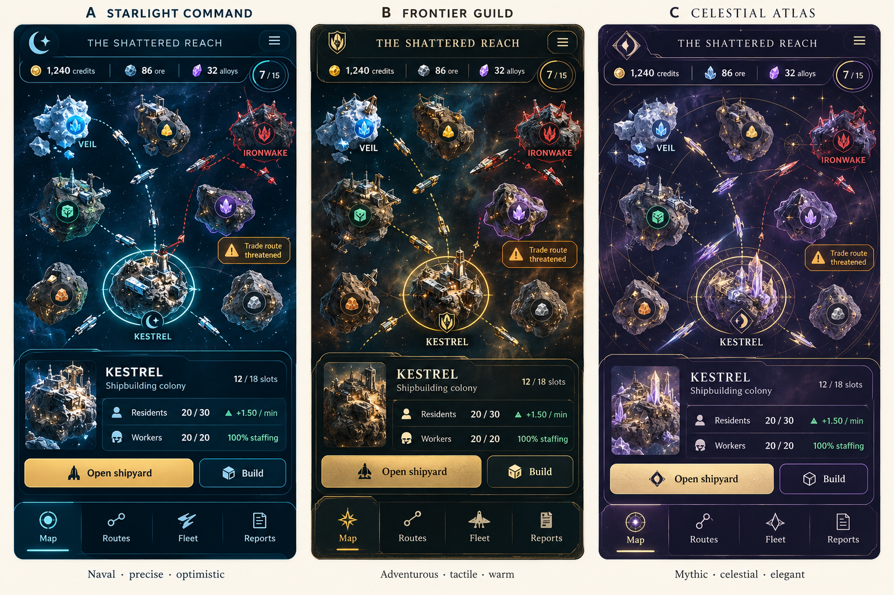
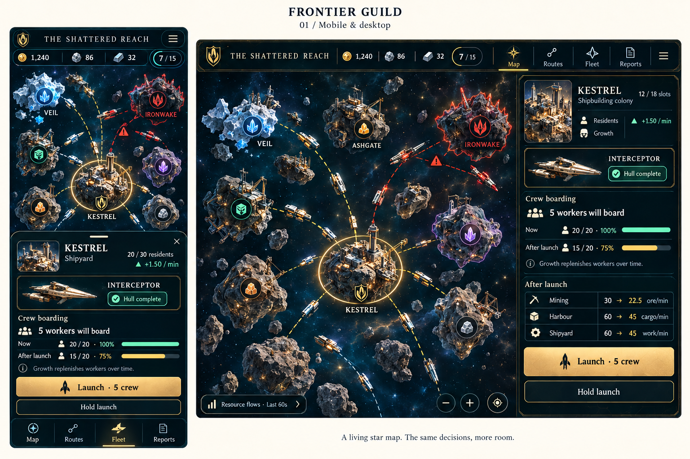

# Round 01: art directions and responsive shipyard

Date: 2026-10-07.

Update: the user found these boards too static. They remain visual references;
[round 02](../round-02/README.md) develops live map play and contextual interaction.

Status: first concept mockups, awaiting direction feedback. Frontier Guild is the
recommended candidate and the subject of the responsive study. It is not yet an
approved art direction. The Shattered Reach is a sample sector name.

## 1. Compare three directions

All three show the same selected asteroid, resources, population, staffing, and
navigation. This makes the atmosphere and panel treatment easier to compare.

| Direction | Character | Candidate palette | Best reason to choose it |
| --- | --- | --- | --- |
| A: Starlight Command | Optimistic exploration and disciplined bridge controls | Ink `#091522`, ice `#EBF5F5`, teal `#68D8CE`, saffron `#E8B65D` | Crisp tactical clarity and a clean naval identity |
| B: Frontier Guild | Merchant guilds, lived-in ports, and adventurous fleets | Petroleum `#101C23`, parchment `#EFE7D3`, brass `#D1AA61`, mint `#8BDBC5` | Warm, tangible colonies and a strong space-opera character |
| C: Celestial Atlas | Ancient star charts and luminous fantasy technology | Aubergine `#151327`, pearl `#F2EDF4`, lilac `#B3A3E5`, gold `#D6BA77` | A distinctive mystical atmosphere |

The references inform broad qualities: the considered bridge ergonomics and
exploration of Star Trek; the working starports, recognizable silhouettes, and
frontier adventure of Star Wars. The game uses its own factions, ships, and symbols.

The recommended next exploration is B, retaining A's data clarity and considering
C's restrained celestial markings. The desired amount of ornament remains open.

## 2. Mobile and desktop shipyard

The mobile bottom sheet expands over part of the map for a focused decision. The
desktop inspector stays beside the map and has room for individual throughput
effects. Both show the same launch and its workforce cost.

### Intended sample state

| Value | Before launch | After launch |
| --- | --- | --- |
| Local residents / housing | 20 / 30 | 15 / 30 |
| Available / required building workers | 20 / 20 | 15 / 20 |
| Shared staffing | 100% | 75% |
| Crew on this interceptor | Awaiting boarding | 5 aboard |
| Mining rate | 30 ore/min | 22.5 ore/min |
| Harbour handling | 60 cargo/min | 45 cargo/min |
| Shipyard work | 60 work/min | 45 work/min |

The displayed pre-launch population growth is +1.50 residents/min under the
proposed curve and full support. At 15 / 30 residents, it recalculates to +1.80/min.
Rates assume power, materials, storage, and services are sufficient. A launch
preview must use the actual current state in the eventual game.

The board's desktop population labels need a typography pass: the intended values
are the explicit resident/capacity and growth rows above. Across both boards,
standardize the alloy icon to a metal ingot; purple crystals identify the natural
crystal resource. Concept rendering does not establish final icon semantics.

## Responsive layout intent

| Viewport | Map and controls | Detail presentation |
| --- | --- | --- |
| Phone portrait, starting at 360 CSS px wide | Compact resource strip, four thumb-reachable navigation items, pan/pinch map | Collapsed colony summary; expandable sheet for construction, launches, or reports |
| Short landscape or tablet | Keep map controls visible and adjust to available height | Compact side inspector when it fits; otherwise a scrollable sheet |
| Desktop, approximately 1024 CSS px and wider | Broad map, top navigation, visible zoom/recenter controls | Approximately 320–380 CSS px inspector with optional report drawer |

The browser prototype should use the available viewport height and device safe
areas. A sheet's contents scroll while its primary action stays reachable. Keep
an explicit close control as well as a drag handle. Sheet movement must not cause
the underlying map to pan. Do not depend on hover to reveal required information.

Target at least 48 CSS px for primary touch controls, ordinary readable body text,
tabular numerals, keyboard access to DOM controls, visible focus, and reduced
motion. These are implementation targets, not measurements established by images.

## Visual hierarchy and interaction

1. Read the map: who owns an asteroid, its one natural resource, active routes,
   selected objects, and immediate threats.
2. Select a colony: view resident capacity, workforce coverage, and usable slots.
3. Open a task: build, edit a route, inspect the shipyard, or read its flows.
4. Preview the consequence: material cost, space, worker demand, or people boarding.
5. Issue the command and show its accepted, queued, blocked, or completed state.

Map, Routes, Fleet, and Reports are the four mobile navigation items. Build is a
contextual colony action. On small screens, a selected asteroid keeps a compact
summary until the player opens details. Deep tasks should be dismissible in one
clear action to return to the map.

Worker counts are informational. The launch control transfers crew from local
residents according to the [crew specification](../../spec/shipbuilding-and-crews.md).
There are no worker assignment sliders. A missing-crew state explains how many
people are still needed and offers a hold action while the population grows.

For distant map views, reduce building artwork to settlement silhouettes and
essential symbols. Selected and nearby colonies can show docks, homes, cranes,
and individual vessels. Texture and nebulae should stay behind the information.

## Candidate Frontier Guild design language

- Petroleum panels and near-black space provide a quiet base.
- Warm ivory carries ordinary text; brass indicates selected objects and primary actions.
- Mint indicates healthy supply, ready states, and positive growth.
- Amber indicates constrained throughput; vermilion indicates hostile activity.
- Pair colour with symbols, outlines, and text, including in alerts and charts.
- Use one legible sans serif for controls and data. A restrained serif or engraved
  display face may appear on sector and colony headings.
- Keep ornament at panel edges and faction emblems. Numerical tables need calm surfaces.
- Give resources stable, distinct symbols: ore rock, ice shard, silicon wafer,
  crystal cluster, and manufactured alloy ingot.

## Next iteration

First resolve the preferred direction and the desired balance between clean
controls and decorative material. Then refine these connected surfaces:

- Colony construction: repeated buildings, footprint, throughput, and shared
  workforce impact before confirming a build.
- Resource flows: stock, rates, interval timestamp, bottlenecks, and incoming
  supplies, beginning with a readable mobile summary.
- Fleet orders: selecting ships, escort/intercept/patrol, and one-handed targeting.
- Lobby: invite friends, configure AI personalities, ready state, and resume/reconnect.

The next UI pass should also resolve portrait density, low-zoom map symbols,
consistent resource icons, and the visible population labels on desktop.
After choosing the visual direction, a browser prototype can establish touch and
responsive behaviour with actual layout rules.

## Feedback record

Feedback: move closer to OpenFront's interactive play style; the first boards
gave an overly static impression. Prioritize a living map and direct commands.
Palette choice remains open.
Record later rounds separately so the original comparison remains available.
