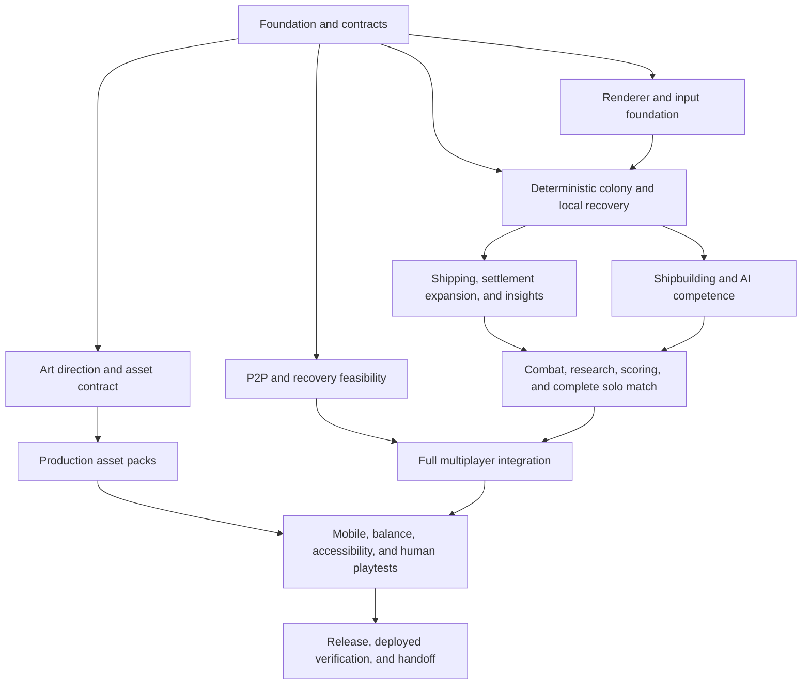

# Full-game implementation plan for an Astra orchestrator

Status: implementation handoff, written 2026-10-07. Repository inspected at
`009e93b` on branch `6.1-sol-medium`. Implementation has not started.

Use **GPT-6-astra** to orchestrate this plan, **GPT-6.1-sol** for engineering that
requires substantial reasoning, and **GPT-6-luna** for bounded work behind stable
interfaces. Use the strongest image-generation capability available to the asset
agents; the currently available tool is `image_gen.imagegen`. Engineering model
selection and image model selection are separate decisions.

This document owns delivery order, agent assignments, dependencies, integration,
and completion evidence. The [specification index](spec/README.md) and its linked
domain documents own game rules. Read the linked sections before each task;
do not copy their balance tables, formulae, catalogues, or acceptance matrices into
this plan. Preserve the distinction between requirements, proposals, and expansions
defined in [status vocabulary](spec/README.md#status-vocabulary).

## 1. Goal and starting evidence

Deliver the [first complete release](spec/vision-and-scope.md#first-complete-release):
a playable mobile and desktop browser game with a complete solo match, physical
industry and shipping, population and crews, combat and piracy, scoring, AI,
economic insight, configurable P2P lobbies, saves, reconnection, and owner recovery.
Completion includes a deployable static build, verified release/recovery behavior,
and player documentation. A feature demonstration alone does not close a milestone.

The [confirmed requirements](spec/vision-and-scope.md#confirmed-requirements) set
the scope. Keep [expansion candidates](spec/vision-and-scope.md#expansion-candidates)
in a separate backlog. In particular, enemy-asteroid conquest, manual staffing,
advanced research branches, extra title presets, and salvage infrastructure are
not prerequisites for the first release. The small research catalogue required by
the default scoring system **is** a prerequisite; it differs from advanced research
branches. Optional caretaker behavior is conditional on D-07.

| Existing material | What to carry forward | What it does not establish |
| --- | --- | --- |
| [Subject specifications](spec/README.md) | Requirements, proposed mechanics, invariants, decision register, acceptance scenarios | Final tuning, resolved network guarantees, or implemented systems |
| [Round 01](design/round-01/README.md) and its images | Three visual directions and responsive shipyard exploration | Selected art direction or the default gameplay layout |
| [Round 02](design/round-02/README.md) and [playable HTML](design/round-02/playable-study.html) | Live map, compact controls, targeting, launch consequences, optional panels | A complete match, durable state, P2P, or device performance evidence |
| [Prototype source](../prototypes/map-play/README.md), [MapStudy.tsx](../prototypes/map-play/src/MapStudy.tsx), [CSS](../prototypes/map-play/app/globals.css) | Interaction vocabulary, selection/target state separation, responsive layout ideas, accessibility starting points | Production rendering, authority, or command validation |
| [Fixture model](../prototypes/map-play/src/model.ts) | Small reproducible examples for interaction comparison | Production rules: supply, attribution, cargo, timing, and launch behavior are simplified |
| [Export script](../prototypes/map-play/scripts/export-study.mjs) and [screenshot script](../prototypes/map-play/scripts/render-study.mjs) | Reviewable artifacts built from actual components | Gameplay assertions; the screenshot script explicitly does not test behavior |

The repository has an isolated prototype package, no root production application,
and no production game test suite or `AGENTS.md`. The prototype's whole-world clone
and React/SVG publication loop should be replaced by worker projections and renderer
interpolation under the [interaction boundary](spec/architecture-and-packages.md#interaction-boundary).
Keep the study intact as a reference. Do not turn its generated HTML into an editing
surface or silently promote its fixture prices and shortcuts into game rules.

A planning-time Chromium smoke rendered the existing HTML in memory, following the
screenshot script's approach. It confirmed moving traffic, a launch transferring
residents into crew and reducing staffing, and reports updating while play continued.
This did not verify touch devices, full gameplay, networking, or performance. Source
inspection and the smoke also exposed a fixture identity bug: `makeShip` spreads a
supplied asteroid object after ship identity fields, overwriting intended freighter
IDs/names. Production constructors must copy coordinates explicitly and test entity
identity invariants; do not transplant that constructor unchanged.

## 2. Decisions to close without stalling independent work

Astra maintains the existing [decision register](spec/decisions-and-research.md#decision-register).
Record conclusions and their evidence there, with detailed behavior in the owning
domain document. Engineering choices within scope can be resolved autonomously.
Escalate a concrete choice when it changes the requested experience, permitted
infrastructure, cost, or failure guarantees. Continue unrelated tasks while that
choice is pending; never describe an unresolved proposal as user-approved.

| Decision or gap | Owner and latest closure point | Work to perform / planning direction |
| --- | --- | --- |
| D-01: permitted connection infrastructure | Astra + N1, before N4 closes | Prove the [transport proposal](spec/multiplayer-and-lobbies.md#transport-proposal). Browser simulation/storage remains local. Compare allowed signaling/STUN and optional TURN arrangements, including credentials and operating cost. Static frontend hosting is separate from a game backend. Never embed a TURN issuer secret in browser assets. |
| D-02: partition and two-peer recovery policy | Astra + N2, before N4 closes | Use strict committed history as the engineering reference; demonstrate strict pause and casual continuation tradeoffs from [D-02](spec/multiplayer-and-lobbies.md#consistency-choice-d-02). Select the advertised product policy before claiming owner recovery. A casual mode needs a deterministic branch-selection rule; divergent inventories cannot be merged. |
| D-03: all-offline resume | Astra + N2/N3, before N4 closes | Specify who must return, which history may resume, and the recovery screen. Follow [recovery contract](spec/persistence-and-recovery.md#recovery-contract); solo restoration and shared-match restoration have different authority requirements. |
| D-04/D-06/D-10: complete rules dataset | F3 initially; Q2 for tuning | Complete missing prices, profiles, timings, starting stocks, upgrades, contracts, projects, and the research catalogue in versioned data. Use the documented proposals as starting hypotheses. Standard titles stay scoped to [default titles](spec/scoring-and-victory.md#default-transferable-titles). |
| Economic boundary details | F2/F3 before E3 and L1 close | Specify resource/power priority and contention, landing-cache/harbour/storage composition, reduced-capacity overflow, construction cancellation/refunds, repair, and upgrade transitions. Extend [production ordering](spec/buildings-and-production.md#interval-ordering-and-contention) and relevant domain sections rather than inventing competing behavior in components. |
| Research and objectives content | F3 before S3 closes | Supply the initial technologies, prerequisites, bonuses, public contract generation, and infrastructure project definitions required by [research](spec/world-and-resources.md#baseline-recipes) and [foundation scoring](spec/scoring-and-victory.md#foundation-point-catalogue). Verify every enabled score path is actually attainable. |
| Shipping and market edge cases | F3/L1 before L1 closes | Resolve order reservation, payment, cancellation, failed delivery, route danger policy, and initial neutral exchange contents in [market trading](spec/logistics-and-trade.md#market-trading). Reconcile the mention of convoy departures with the deferred advanced convoy-scheduling expansion; document the initial scope. |
| D-05: visual direction | Astra/art lead + A0 before bulk art | Evaluate at actual gameplay scale using the [current design study](design/round-02/README.md). Frontier Guild is a candidate, not an approved final direction. Keep functional placeholder art until a coherent direction is selected. |
| D-07/D-09/D-13/D-14: proposed lifecycle details | F3, then C2/S1 | Adopt and record the support/rescue/growth/crew details needed for one consistent preset. Preserve the confirmed worker, growth, and crew requirements. Decide caretaker scope explicitly; an omitted optional caretaker does not erase disconnected players' assets. |
| D-11: live-version retention and migrations | F2/N3 design; X1 before release | Select the supported recovery window and hosting retention mechanism using [app/save versions](spec/persistence-and-recovery.md#app-and-save-versions). Keep application, protocol, rules, and save-schema compatibility explicit. |

N4 requires real network and mobile evidence. If devices, networks, or an allowed
relay are unavailable, record the exact missing evidence and keep the gate open.
Solo development may continue against the stable contracts; release claims must
wait for verification or an explicitly agreed scope change.

## 3. Agent policy and parallel ownership

### Model routing

| Label used below | Model / reasoning | Appropriate work |
| --- | --- | --- |
| A | `gpt-6-astra`, high; increase for unresolved architecture tradeoffs | Orchestration, dependency and decision review, integration judgment, art direction, milestone acceptance |
| S | `gpt-6.1-sol`, medium | Feature integration, standard tooling, scoped UI and runtime implementation |
| S+ | `gpt-6.1-sol`, high | Determinism, resource/population accounting, cargo provenance, combat attribution, AI, authority, persistence, difficult defects |
| L | `gpt-6-luna`, medium | Small components, accessible tables, empty/error states, fixture assembly, documentation/link checks, asset manifest/tooling tasks |
| I | Strongest available image-generation tool/model | Actual image generation and visual edits; currently `image_gen.imagegen`, coordinated by A |

Luna tasks must have a frozen input/output contract, narrow paths, and a measurable
exit condition. Split large UI tasks into Luna presentation subtasks under a Sol
integrator. Escalate ambiguous state transitions or repeated integration failures
to Sol. Authority, accounting, and save correctness always receive Sol review,
even if a bounded helper was initially produced by Luna. Gameplay AI is local
utility logic from [AI players](spec/ai-players.md#shared-competence), not an LLM
service or agent framework.

### Worktree and shared-file rules

1. Astra keeps one integration branch derived from `6.1-sol-medium`, with a recorded
   base commit for every task. Prefer a separate Git worktree/branch per coding
   agent. If agents share a checkout, enforce exclusive path ownership and serialize
   Git index, checkout, and commit operations.
2. One writer at a time owns root package/lock/config files; F1 initially owns them.
   One contracts lead owns shared model schemas, command/event unions, public
   exports, and versioned balance data. One kernel lead owns economic-step ordering,
   the simulation entry point, and transaction application. F2 establishes these
   roles; E3 carries kernel integration forward.
3. Agents own leaf modules and their focused tests. Request shared-contract changes
   from the lead with a concrete type/schema proposal. Astra lands the change first,
   then tells consumers to update. Do not independently redefine cargo, population,
   clocks, identity, or commitment in another subsystem.
4. A task may begin against committed typed fixtures once its interface is frozen;
   it cannot be marked complete before integration with its real dependencies.
   Renderer animation, UI previews, and analytics may not mutate authoritative state.
5. Integrate small dependency-complete changes, review against source documents,
   run relevant checks, and attach evidence. Shared-file conflicts return to the
   designated owner; avoid repeated large merges at milestone end.
6. Preserve failed seed/replay/network traces as regression fixtures. One agent owns
   each failure until fixed and independently reviewed. Root configuration and
   golden fixtures require deliberate updates, not automatic acceptance of changes.

Use a maximum of **six active workers plus Astra** when the runtime offers seven
slots. Reuse agents between phases. Reserve capacity for an integration/review agent
instead of filling every slot with new code. A useful steady allocation is two
domain engineers, one renderer/UI engineer, one persistence/network engineer, one
verification engineer, and one Luna or asset task. Reallocate from the ready queue;
there is no value in starting six tasks blocked on the same schema.

### Contracts to freeze first

F2 publishes these contracts with examples and tests, following the
[architecture](spec/architecture-and-packages.md#proposed-code-boundaries):

- Canonical entity IDs, fixed-point units, deterministic ordering/RNG, rules version,
  state schema, tick phases, command validation, atomic effects, and domain events.
- Cargo/container/provenance and population-location transitions; common building
  service budgets; ledger reason codes and event identities.
- Command receipt states, deduplication, ordered update envelopes, hashes, and
  snapshot/journal replay. Separate transport receipt, simulation acceptance, and
  durable commitment. Specify how tick advancement and owner-generated AI decisions
  enter replay so replicas do not create extra outcomes.
- Transport, durable-store, identity, and authority interfaces. N2 defines the
  commit/election/membership protocol; N3 returns durability receipts rather than
  independently declaring a multiplayer commit. Specify payload/rate limits,
  bounded input and pending queues, snapshot chunk/assembly limits, timeouts, and
  explicit rejection/backpressure behavior at the untrusted message boundary.
- Worker projections, batched updates, read-only selectors, command submission,
  local selection/target/camera state, and renderer asset handles.

Freeze interface versions, not an oversized implementation. Complete a small
command-to-commit-to-reload example first. Cross-browser replay/hash checks should
begin here, before subsystem volume makes divergence difficult to isolate.

## 4. Delivery graph and scheduling

This expands the existing [delivery milestones](spec/delivery-and-validation.md).
The graph shows integration gates; the task tables supply precise dependencies.
An ID in “Requires” means completed work, unless the task explicitly describes a
contract-only start. Gate names represent every task required to close that gate.



Critical engineering path: F2 → E3 → L1/L2 → S1/S2/S3 → H2/S4 → C2 → G3 → P1 → Q/X.
Network feasibility N4 and art/performance can run alongside this path, but cannot
be silently dropped at release. C1 starts earlier so AI is available for headless
evaluation before all combat behaviors exist.

### Foundation and feasibility — G0

| ID / model | Requires | Exclusive work and deliverable | Completion evidence / source |
| --- | --- | --- | --- |
| F0 / A | None | Re-audit current branch and spec changes; record decisions, task owners, source links, evidence locations, and pending external inputs in `docs/implementation-status.md` (create during implementation). | Scope mapped to [requirements](spec/vision-and-scope.md#confirmed-requirements); no proposal silently promoted. |
| F1 / S | F0 | Root static Next.js/TypeScript/Tailwind application, package/config ownership, worker build path, typecheck/lint/build/test scripts and CI. Keep prototype isolated. Pin verified package versions. Add concise project guidance once patterns exist. | Root static export and worker loading pass; prototype still works independently. [Application shape](spec/architecture-and-packages.md#application-shape), [package shortlist](spec/architecture-and-packages.md#package-shortlist). |
| F2 / S+ | F1 | `src/game/model`, shared protocol types, simulation kernel/transactions, RNG/time/hash primitives, worker contracts, headless test and replay harness. Establish named schema/kernel owners. | Identical command trace gives identical state/hash in Node and supported browser engines; duplicate/invalid commands leave state correct. [Clock and determinism](spec/architecture-and-packages.md#clock-and-determinism). |
| F3 / S+ | F2 | Versioned rule/content dataset and missing domain decisions from section 2. Own initial balance data; expose typed read access to other agents. Catalogue completeness validators. | Complete starting/recovery economy and every enabled feature has data; proposed values remain labeled for tuning. [D-06](spec/decisions-and-research.md#decision-register), [world](spec/world-and-resources.md). |
| N1 / S+ | F2 | `src/game/network` and local identity module: transport adapter, minimal room joining, secure reconnect proof, invite admission, version negotiation, duplicate-tab/session generation, bounded ingress and snapshot assembly. | Different peers can join/rejoin the correct slots; an invite does not impersonate another player; oversized/incomplete streams release bounded buffers. [Transport](spec/multiplayer-and-lobbies.md#transport-proposal), [identity](spec/multiplayer-and-lobbies.md#identity-trust-and-versions). |
| N2 / S+ | F2 | `src/game/protocol` authority implementation: durable commit policy, terms/votes, membership, log freshness, pending retries, uncommitted suffixes, snapshot repair, owner transfer, validated command-rate and pending-window limits. Develop against fake transport/store interfaces. | Fault harness proves the selected policy and exposes the two-peer tradeoff; old-owner updates are rejected; floods trigger bounded rejection/backpressure. [Replication](spec/multiplayer-and-lobbies.md#replication-protocol), [host transfer](spec/multiplayer-and-lobbies.md#host-transfer). |
| N3 / S+ | F2 | `src/game/persistence`: transactional journal/checkpoints, recovery metadata, private identity storage, import/export validation, schema migrations and durable receipts. Inspect storage capabilities, request persistent storage appropriately, and expose actual availability/failure status. | Restore from journal after crash; corrupt snapshot and quota failure preserve the last usable state; denied persistence never reports guaranteed saving. [Storage](spec/persistence-and-recovery.md#storage-proposal), [checkpoint contents](spec/persistence-and-recovery.md#checkpoint-contents), [browser lifecycle](spec/persistence-and-recovery.md#browser-lifecycle). |
| N4 / S+ + A | N1, N2, N3 | Minimal stateful network/recovery slice, automated fault scenarios and real-device/network evidence. Include denied/quota-limited storage, oversized messages, floods and interrupted snapshot streams. | D-01–D-03 resolved; all applicable [Milestone 0 evidence](spec/delivery-and-validation.md#milestone-0-networking-and-recovery-feasibility) recorded, including partitions, all-offline resume and stale-owner return. |
| R1 / S+ | F2 | `src/game/rendering` scene/camera/hit-test/interpolation/LOD foundation plus worker bridge. Validate Pixi/viewport compatibility, projection batching, context-loss recovery and synthetic scene costs. | Camera and moving fixtures remain responsive at the [performance target](spec/interface-and-art-direction.md#performance-direction); measured result and device limitations recorded. |
| R2 / S | R1 | `src/features/map` selection, targeting, explicit command feedback, fleet/object disambiguation, cancel, keyboard and touch controls. | Port the study's behavior to production interfaces and exercise [interaction scenarios](spec/delivery-and-validation.md#important-domain-checks); drag/pinch cannot accidentally issue commands. |
| U0 / L | F1; F2 projection shapes | `src/ui` and designated theme stylesheet: buttons, sheets, inspector shell, focus behavior, status labels, safe areas, reduced motion, text/table primitives. | Component examples at phone portrait/landscape and desktop widths satisfy [feedback/readability](spec/interface-and-art-direction.md#feedback-and-readability). Sol reviews integration. |
| A0 / A + I | F0; coordinate R1 texture needs | Direction evaluation and production asset contract; see section 5. Own new design evidence without modifying historical rounds. | Direction decision and actual-scale contact sheet; placeholder renderer remains usable. [D-05 and current study](design/README.md). |

G0 closes on F0–F3, N4, R1/R2/U0, and a documented A0 direction/contract outcome.
F2 enables independent coding before the entire gate closes. Continue the colony
track if only external N4 evidence is waiting; keep the feasibility gate visibly open.

### Deterministic economy and local play — G1

| ID / model | Requires | Exclusive work and deliverable | Completion evidence / source |
| --- | --- | --- | --- |
| W1 / S+ | F2, F3 | `src/game/world`: seeded world, resource/size distribution, neutral exchanges, navigation geography, starts and deployment data. | Repeated seeds match; generation rejects unreachable/economically blocked starts and verifies [generation constraints](spec/world-and-resources.md#generation-constraints). |
| E1 / S+ | F2, F3 | `src/game/simulation/production`: buildings, local assembly, slots/reservations, enabled/damaged/upgraded states, extraction/recipes, power/input/storage allocation and service budgets. | Focused and generated checks for [production invariants](spec/buildings-and-production.md#invariants); implement modules without editing kernel order. |
| E2 / S+ | F2, F3 | `src/game/simulation/population`: housed/displaced states, support/reserves, shared workforce, growth and population transaction helpers. Own all population-transfer primitives. | [Workforce](spec/housing-and-workers.md#shared-workforce-coverage) and [growth/recovery](spec/population-growth.md#interval-progress-and-recovery) checks pass with fractional work and zero-worker recovery. |
| M1 / S+ | F2, F3, W1 | `src/game/simulation/navigation`: deterministic paths, vessel position/order lifecycle, arrival effects, physical rerouting, fuel and stalled-vessel recovery. | Stable path ties and replay; retargeting continues from current location. [Physical shipping](spec/logistics-and-trade.md#physical-shipping), [orders](spec/combat-and-piracy.md#orders-and-fighting). |
| E3 / S+ | W1, E1, E2, N3 | Kernel lead wires authoritative economic ordering, ledgers, worker runtime and local commit/reload path. Integrate initial colony fixtures. | [Milestone 1](spec/delivery-and-validation.md#milestone-1-deterministic-economy-and-settlements) passes through real commands and save/replay; no UI-derived production. |
| U1 / S with L subtasks | E3, R2, U0 | Minimal local solo start, `src/features/settlement` and construction/population panels using domain previews/selectors. Expose persistence availability, failed-save status and export/import controls. Luna may own individual display components. | Player starts, builds, supplies households, observes growth and restores a save. Storage denial/failure is visible and stops safe-save claims. [Building interface](spec/buildings-and-production.md#interface-requirements), [mobile layout](spec/interface-and-art-direction.md#mobile-layout), [browser lifecycle](spec/persistence-and-recovery.md#browser-lifecycle). |

G1 closes on W1/E1/E2/E3/U1. M1 may overlap the end of G1. Require an interactive
colony using the real engine, plus deterministic recovery evidence, before moving
the integration baseline to shipping. E1/E2 parallelize behind the service and
population interfaces; E3 alone chooses their invocation order.

### Shipping, expansion, markets, and insights — G2

| ID / model | Requires | Exclusive work and deliverable | Completion evidence / source |
| --- | --- | --- | --- |
| L1 / S+ | E3, M1 | `src/game/simulation/logistics`: cargo lots/lineage, loading/unloading, shared port budgets, route policies, assignments, reserves, market orders, finite demand/prices and atomic settlement. | Shared-port contention, cancellation, theft-ready ownership and consumption provenance reconcile under replay. [Logistics](spec/logistics-and-trade.md), especially [cargo identity](spec/logistics-and-trade.md#cargo-identity-and-ownership). |
| L2 / S+ | E3, M1 | `src/game/simulation/transfers`: passengers, rescue, colony-kit assembly/deployment and competing neutral claims. Use E2 population primitives; coordinate with L1 service budgets. | One population location throughout travel/cancellation/rescue; a new colony can unload and bootstrap itself. [Moving workers](spec/housing-and-workers.md#moving-workers), [starting conditions](spec/world-and-resources.md#starting-conditions). |
| H1 / S+ | F2 for skeleton; E3, L1, L2 to finish | `src/game/analytics`: signed ledger aggregation, bounded history, bottleneck/forecast selectors, supported-population and useful-delivery histories. Publish selectors needed by scoring and AI. | Reports reconcile with inventories, credits and people after replay; windows survive restoration. [Resource accounting](spec/economy-insights.md#resource-accounting), [integrity](spec/economy-insights.md#integrity-requirements). |
| U2 / S with L subtasks | U1, L1, L2, H1 | Route/market/passenger/colonization controls and economic reports. Lazy-load charts; provide equivalent accessible tables and stale/recovering states. | A player operates and diagnoses a multi-colony supply chain without leaving live play. [Route policies](spec/logistics-and-trade.md#route-policies), [report surfaces](spec/economy-insights.md#reporting-surfaces). |

G2 closes on L1/L2/H1/U2 and the [Milestone 2 evidence](spec/delivery-and-validation.md#milestone-2-shipping-and-insights).
Validate a sustained supply chain, a support shortage and recovery, interrupted
passenger travel, and export/import of its save. Cross-domain service-budget and
provenance tests are required before combat starts capturing real cargo.

### Complete solo game — G3

| ID / model | Requires | Exclusive work and deliverable | Completion evidence / source |
| --- | --- | --- | --- |
| S1 / S+ | E3, M1 | `src/game/simulation/shipbuilding`: ship projects/bays, ready hulls, holds, commissioning, crew manifests and demobilization; casualty API consumed by S2. Use E2 population helpers. | Two hulls competing for crew, launch productivity cost, crew waiting and reload all satisfy [construction/commissioning](spec/shipbuilding-and-crews.md#construction-and-commissioning) and [crew lifecycle](spec/shipbuilding-and-crews.md#crew-lifecycle). |
| S2 / S+ | S1, L1, L2 | `src/game/simulation/combat`: military roles/orders, escorts, deterministic engagements/retreat/repair, attribution, piracy/secured captures, blockades/service damage and passenger rescue integration. | [Combat rules](spec/combat-and-piracy.md) and anti-farming scenarios pass; capture and securing are distinct events; destruction cannot duplicate population losses or awards. |
| S3 / S+ | E3, L1, H1, F3 | `src/game/simulation/objectives`: initial research progression, contracts, infrastructure projects and stable completion IDs. Production supplies research work; this module owns spending and completion. | Feasible generated contracts; research prerequisites and benefits operate; all enabled [foundation paths](spec/scoring-and-victory.md#foundation-point-catalogue) have reachable completion fixtures. |
| H2 / S+ | H1, S1, S2, S3 | The H1 analytics owner integrates later producer events: crew/casualties, fuel/repairs, loot/losses, research, contracts and projects. Extend the same ledgers/history/selectors for scoring and results. | Fleet economics and new-domain histories reconcile after replay and supply real scorecard/results data. [Reporting surfaces](spec/economy-insights.md#reporting-surfaces), [population reporting](spec/economy-insights.md#population-and-life-support). |
| S4 / S+ | H2 | `src/game/simulation/scoring`: qualifications, conditional colony points, achievements, default titles, ties, victory timer and durable match-end event. | Scoring exploits, title changes, simultaneous finishes and replay are covered by [scoring/victory](spec/scoring-and-victory.md) and [domain checks](spec/delivery-and-validation.md#important-domain-checks). |
| C1 / S+ | E3, L1, L2, H1 | `src/game/ai` shared planner: survival, development, support/crew forecasts, legal command interface, stable plans, budgets and serialized state. Start headless match runner and metrics. | Bots sustain viable colonies without privileged commands or hidden bonuses. [Shared competence](spec/ai-players.md#shared-competence), [planning cadence](spec/ai-players.md#planning-cadence). |
| C2 / S+ with L config tasks | C1, S1, S2, S3, S4 | Personality strategies, difficulty, tactical reactions and victory planning. Cover required Pirate/Competitor/Warlord behavior first, then the remaining proposed catalogue as scoped in F0. Optional caretaker follows D-07. | Distinct observable behavior, successful match completion, resumed plans after owner change; [AI evaluation](spec/ai-players.md#evaluation). Luna can assemble config/fixtures after strategy interfaces stabilize. |
| U3 / S with L subtasks | U2, S1, S2, S3, S4, C2 | Complete solo configuration/start-match flow, AI/preset selection, shipyard/fleet controls, research/contracts/projects, scorecard, results timeline and first-play guidance. Use the canonical match-configuration contract later consumed by P2. | Complete playable journey from solo setup through victory/results and a new match; panels preserve threat/time awareness. [Main surfaces](spec/interface-and-art-direction.md#main-surfaces), [scorecard](spec/scoring-and-victory.md#player-facing-scorecard). |

G3 closes on S1–S4/H2/C1/C2/U3 and [Milestone 3](spec/delivery-and-validation.md#milestone-3-complete-solo-matches).
Require human-playable economic, population, mixed, warfare and piracy strategies,
plus repeatable headless matches. “Bots eventually end a match” alone does not prove
useful controls, attainable peaceful scoring, or acceptable balance.

S1, S3 and C1 can proceed in parallel after their own prerequisites; S2 and S4 are
integration-heavy and follow the listed producer events. Do not add a second
population, useful-delivery, or support-window implementation inside scoring/AI.

### Full multiplayer integration — G4

| ID / model | Requires | Exclusive work and deliverable | Completion evidence / source |
| --- | --- | --- | --- |
| P1 / S+ | N4, G3 | Protocol/kernel leads integrate the complete simulation, snapshots, journals, AI plans and hashes into the proven authority policy. Checkpoint payloads remain bounded. | Domain traces remain identical through pending retries, migration, repair and partitions. [Milestone 4](spec/delivery-and-validation.md#milestone-4-full-multiplayer-integration), [recovery invariants](spec/persistence-and-recovery.md#recovery-invariants). |
| P2 / S with L presentation tasks | N4, U0; P1 to finish | `src/features/lobby` and recovery screens: static invite entry, human/AI slots, rules/preset lock, ready/start, reconnect identity, duplicate-tab handling, persistence availability/failure and clear recovery status. Reuse solo configuration primitives. | End-to-end invited match, correct returning slot, incompatible-client rejection and all-offline policy are usable; failed storage cannot appear safely saved. [Lobby](spec/multiplayer-and-lobbies.md#lobby-experience), [reload sequence](spec/persistence-and-recovery.md#reload-sequence). |
| P3 / S+ | P1, P2 | Dedicated browser fault suite and repeated real network/mobile trials with the complete game. Separate scenario ownership from protocol implementation. Revalidate ingress/rate/queue limits against full-game messages and snapshots. | Saved traces cover clean/abrupt owner loss, suspension, partitions, denied/failed storage and stale owners while cargo, growth, crews and victory timers are active; flooding and partial snapshots stay bounded. [Verification approach](spec/delivery-and-validation.md#verification-approach). |

G4 closes after P1/P2/P3 demonstrate the advertised policies with humans and AI.
AI commanders never count as independent peers or votes. Integrate networked domain
smoke tests during earlier milestones; G4 is the complete-game gate, not the first
occasion that real game state crosses a connection.

### Mobile, balance, release and handoff — G5/G6

| ID / model | Requires | Exclusive work and deliverable | Completion evidence / source |
| --- | --- | --- | --- |
| Q1 / S+ with L UI fixes | G3 and integrated art for early passes; G4 to finish | Device/browser performance and accessibility sweep. Profile simulation/AI, projections, renderer, reports, saves, peer traffic, memory, loading and context recovery separately. | Recorded devices/scenes meet [performance direction](spec/interface-and-art-direction.md#performance-direction) and [mobile controls](spec/map-interaction-and-gameplay.md#mobile-controls); real touch and keyboard tests supplement automation. |
| Q2 / S+ + A | C2, H1, S4 | Seeded headless tournaments plus human playtests; balance revisions through the data owner. Compare starts, personalities, strategies, support failures and crew replenishment. | Evidence addresses [Milestone 5 metrics](spec/delivery-and-validation.md#milestone-5-mobile-and-balance) and [AI evaluation](spec/ai-players.md#evaluation). Version/replay fixtures updated deliberately when rules change. |
| Q3 / S+ | G4, Q1, Q2, A4 | Integrated regression of the complete new-player, returning-player and completed-match journeys; independent source-to-feature audit. | Every confirmed requirement and enabled preset feature maps to working behavior and recorded evidence. Open defects have severity, owner and release disposition. |
| X1 / S+ | N3 and D-11 for design; Q3 for release candidate | Static deployment configuration, immutable compatible assets, cache/update policy, migration fixtures, rollback/export/recovery runbook and dependency/license/secret-exposure checks. Offline cached shell is optional if explicitly included. | Old active match survives a new application deployment; supported saves migrate, unknown saves remain intact/exportable. [App/save versions](spec/persistence-and-recovery.md#app-and-save-versions). |
| X2 / S with L docs | X1 | Build release artifact; publish when deployment is authorized to the selected static host; verify actual URLs, fragment invites, worker/assets, fresh/reloaded sessions and rollback procedure. Player help, supported browsers, troubleshooting and operational handoff. | End-to-end deployed solo and multiplayer smoke plus real recovery evidence. No hidden runtime server dependency; release limitations accurately match tested conditions. |
| X3 / A | X2, all gate evidence | Final requirement audit, release notes, remaining expansion backlog and handoff with reproducible build/test/deploy commands. | First complete release is usable from landing/setup to results and later restoration; no required feature left as a fixture, TODO, or simulated success. |

G5 closes on Q1–Q3 and the final art gate. G6 closes on X1–X3. Deployment is part of
the finish line, but preparation and verification of a reviewable release artifact
come before any newly needed publishing decision. Do not couple the game to a
hosting vendor or introduce an application backend merely to deploy it.

## 5. Asset-generation track

The asset track supports the [map hierarchy](spec/interface-and-art-direction.md#map-hierarchy)
and [live interaction direction](spec/map-interaction-and-gameplay.md#information-hierarchy-and-art).
Art must improve recognition of vessels, resources, services and threats at phone
scale. Large illustrations belong in optional views. Use original ships, factions
and symbols, drawing atmosphere from the existing boards.

### Image model selection

Astra is the art director and visual reviewer. Asset workers invoke the best
image-generation model/tool actually exposed in their execution environment.
Currently that is `image_gen.imagegen`; its exposed schema has no model selector,
so do not invent an image-model version or assume `gpt-6.1-sol`/`gpt-6-luna` generates
pixels. If future tooling offers a documented quality/model choice, choose its
strongest available setting for source art and record it in the manifest. If image
tools are unavailable, continue with procedural placeholders and leave final art
acceptance open rather than claiming finished assets.

Inspect all supplied references before editing them. Use the image tool for visual
generation and edits, including background removal; request transparent backgrounds
for sprites. Technical validation, lossless packaging, atlas assembly and runtime
format conversion can use deterministic tooling. Follow the image tool's current
reference-image and output-handling contract, and persist the actual output files.
Never count a prose asset description as a delivered image.

### Packages and dependencies

| ID / model | Requires | Owned artifacts | Acceptance |
| --- | --- | --- | --- |
| A0 / A + I | F0; renderer coordination | Comparable small direction samples and new design notes; style/texture contract. Use [round 01](design/round-01/README.md) for atmosphere and [round 02](design/round-02/README.md) for gameplay composition. | Select direction at real map scale; set camera/projection, forward axis, lighting, anchors, scale, alpha/padding, faction tint/mask convention, LODs and texture budgets. |
| A1 / A-coordinated I worker | A0, F3 | `assets/source/ships/`: original civilian, military and settlement/passenger/rescue appearances required by the pinned hull/mission catalogue; shared hulls may use overlays. | Distinct readable silhouettes, consistent orientation/scale, clean alpha, neutral reusable ownership treatment. No duplicated hull designs solely for each faction color. |
| A2 / A-coordinated I worker | A0, F3 | `assets/source/world/` and `assets/source/buildings/`: asteroid families, surface variants, close-zoom modules, appropriate construction/damage appearances and distant settlement silhouettes. | Size/resource readability, capacity cues and building-ID coverage match [world](spec/world-and-resources.md#asteroids) and [building catalogue](spec/buildings-and-production.md#initial-building-catalogue). |
| A3 / A-coordinated I worker + L vector tasks | A0, F3 | `assets/source/factions/`, backgrounds, resource/commodity symbols and UI embellishments. Keep small semantic icons in reliable vector form where practical. | Ownership and resource encodings remain distinct; resource IDs match [catalogue](spec/world-and-resources.md#resource-catalogue). Address the [round 01 icon feedback](design/round-01/README.md#intended-sample-state). |
| A4 / L tooling + S renderer + A review | A1, A2, A3, R1; integrated U3 for final review | `scripts/assets/`, `public/assets/game/`, typed texture manifest, atlas metadata, fallbacks, source provenance and in-game contact sheets. Renderer integration stays with its owner. | Validate dimensions/alpha/anchors/IDs and bounded texture usage; inspect phone/desktop gameplay and zoom levels; no missing textures or licensing/provenance gaps. |

Run A1/A2/A3 in parallel only after the style contract is stable, within the total
worker limit. Generate a small representative batch, inspect it in the running map,
then scale production. Regenerate only rejected pieces using the accepted references
to retain consistency. Engineering progresses with stable asset IDs and placeholders.

The asset manifest owns filenames, source references, prompts/tool identity,
revision, rights/source notes, dimensions, pivots, padding, masks, LODs, compression,
and review status. It references authoritative entity IDs; it does not contain
costs, recipes, crew complements, or combat balance. Derive asset coverage from
the pinned game catalogue rather than copying a second catalogue into this plan.

Keep labels, numbers, selection rings, health, route lines and progress indicators
in controlled renderer/DOM overlays. Do not bake live information into generated
images. Procedural restrained effects and optional licensed/synthesized audio are
separate renderer/media tasks; an image model is not an audio generator. Any audio
must follow [optional audio behavior](spec/interface-and-art-direction.md#feedback-and-readability).

## 6. Verification and evidence contracts

Use the [existing domain-check matrix](spec/delivery-and-validation.md#important-domain-checks)
as the scenario source. The implementation status file records which test or manual
run proves each applicable scenario; avoid copying the entire matrix into a second
document. Add missing scenarios to their domain document when implementation exposes
a new edge case.

| Layer | Owner and start | Required evidence |
| --- | --- | --- |
| Rules and conservation | Each Sol domain owner, from F2 | Focused rules plus generated operation sequences for bounds, cargo/credit/population accounting, idempotency and [recovery invariants](spec/persistence-and-recovery.md#recovery-invariants). Test meaningful behavior, not implementation-shaped assertions. |
| Replay and compatibility | Kernel + persistence owners, from F2/N3 | Snapshot plus journal equals uninterrupted execution; hashes match across supported browser engines; mismatched versions reject cleanly; schema fixtures cover corruption and supported migrations. |
| Network faults | Independent Sol verifier, from N2 | Fake-transport deterministic faults plus real multi-browser integration, followed by [real-network/mobile evidence](spec/delivery-and-validation.md#milestone-0-networking-and-recovery-feasibility). Local tabs are insufficient for NAT/suspension claims. |
| Interaction and accessibility | UI/render owner + verifier, from R2 | Gesture suppression, stale targets, command feedback, fleet selection, keyboard/focus, screen-size/safe-area checks, accessible reports, and physical controls on actual phones. |
| Art and performance | A4/Q1 | Actual-size visual review, packaged asset checks, measured scene/worker/network/storage costs and sustained full-match memory behavior. Record device/browser/build and scene/seed with results. |
| Balance and player experience | C1/Q2 | Reproducible seed/settings batches with metrics from [delivery](spec/delivery-and-validation.md#milestone-5-mobile-and-balance), plus observed human sessions and concrete tuning decisions. |
| Release | Q3/X1/X2 | Static build, clean installation, deployed URL smoke, live-version reload after deployment, restore/export/import, and complete start-to-results journeys. |

CI should run typecheck, focused tests, the stable invariant/replay suite and static
build on ordinary changes. Broader seed batches, browser matrices and device/network
runs belong at integration/release gates and after relevant failures or changes.
Once checks pass, do not repeatedly run unrelated suites without a reason.

Never substitute a screenshot for gameplay correctness or a headless tournament
for mobile usability. Record pending/unavailable manual evidence explicitly. An
automated check passing on Chromium alone does not establish Safari/iOS support.

## 7. Astra execution and handoff protocol

At startup, read this plan, the current [decision register](spec/decisions-and-research.md),
the [architecture](spec/architecture-and-packages.md), and changed source documents.
Inspect current branch/files before assigning work; the repository may have evolved
since this plan. Reuse verified work instead of rebuilding the interaction study.

For each task, issue a concrete assignment using this template:

```text
Task ID / milestone:
Model / reasoning:
Base commit / task branch or worktree:
Requires: completed tasks, frozen contract versions, pending inputs
Read first: exact source document section links
Goal: observable behavior and reviewable deliverables
Own: exclusive file paths and tests
Shared changes: named contract/kernel/config owner and change-request procedure
Interfaces: read models, commands, events, fixtures and asset IDs
Acceptance: focused checks, integration scenario and evidence artifact
Out of scope: relevant expansion boundary
Return: changed paths/commits, checks actually run, evidence, unresolved decisions
```

Use the exact available model IDs from section 3 when spawning workers. If model
overrides require a limited/no-history fork, provide this assignment and repository
path explicitly. Asset assignments additionally carry the style contract, reference
images, target dimensions/alpha/pivot, batch size and actual-scale review criteria.

The first dispatch sequence is F0 → F1 → F2. After F2, fill available slots with F3,
N1, N2, N3 and R1, reserving review capacity. U0 and A0 can use a freed slot; A0's
direction exploration can start earlier. Schedule W1/E1/E2 as their data/contracts
stabilize. This prevents several agents from simultaneously inventing the root app
or the state schema. Later scheduling follows task prerequisites, not section order.

On each completion, Astra reviews the diff against the linked source, integrates
it with the actual dependencies, runs the appropriate checks, and updates the
status/evidence record. A report of success is not enough without the artifact or
test result. For accounting, protocol, persistence, scoring and AI recovery changes,
assign an independent Sol reviewer or perform a substantive Astra review.

When blocked, record the dependency, the concrete missing decision/evidence, and
the tasks that can still proceed. Ask only for information or authorization that is
actually missing. Do not substitute an easier game architecture, remove a required
feature, or close an evidence gate to make the status appear complete.

The final handoff contains the playable release/build location, reproducible setup
and verification commands, decision resolutions, evidence links, save/version and
hosting operations, known limitations, and the separate expansion backlog. Keep
domain rules in their existing documents and exact runtime tuning in versioned data.
